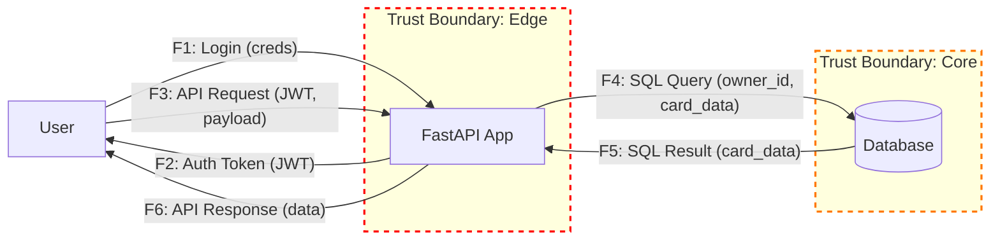

# DFD — Data Flow Diagram

## Диаграмма (Mermaid)



## Список потоков

| ID | Откуда → Куда | Канал/Протокол | Данные/PII | Комментарий |
|----|---------------|-----------------|------------|-------------|
| F1 | User → API    | HTTPS           | `login`, `password` | Аутентификация пользователя |
| F2 | API → User    | HTTPS           | `JWT`      | Выдача токена сессии |
| F3 | User → API    | HTTPS           | `JWT`, `card_data` | Основные запросы к API (GET, POST, PATCH) |
| F4 | API → DB      | TCP/IP (TLS)    | SQL-запросы, PII | Чтение/запись данных карточек и пользователей |
| F5 | DB → API      | TCP/IP (TLS)    | Данные карточек | Получение данных из БД |
| F6 | API → User    | HTTPS           | Данные карточек | Ответ API с запрошенными данными |
| F7 | User → API    | HTTPS           | `JWT`, `column_id` | Перемещение карточки (`PATCH /move`) |
```
